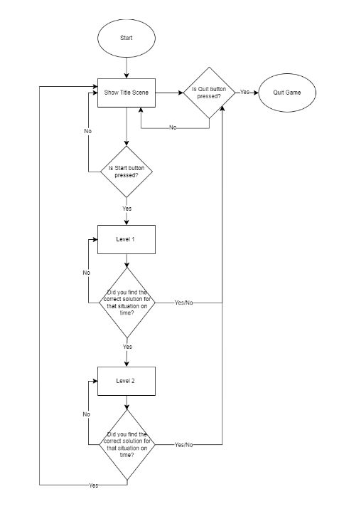
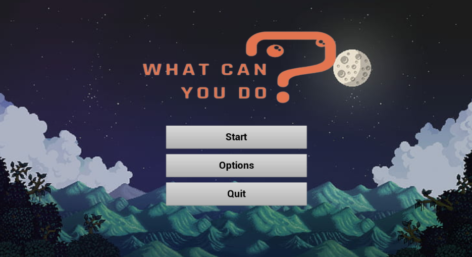
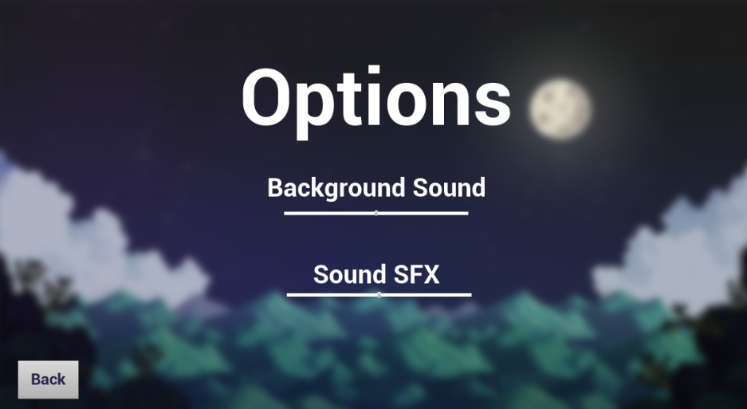
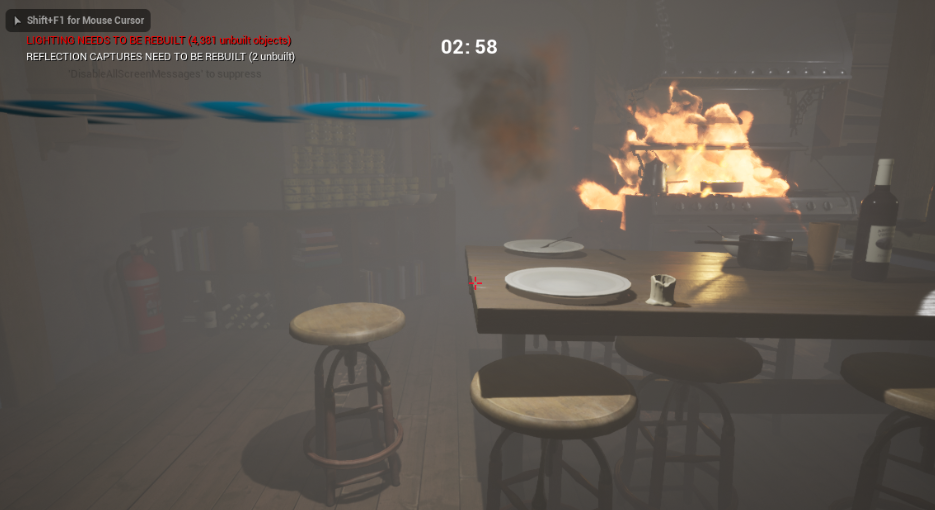
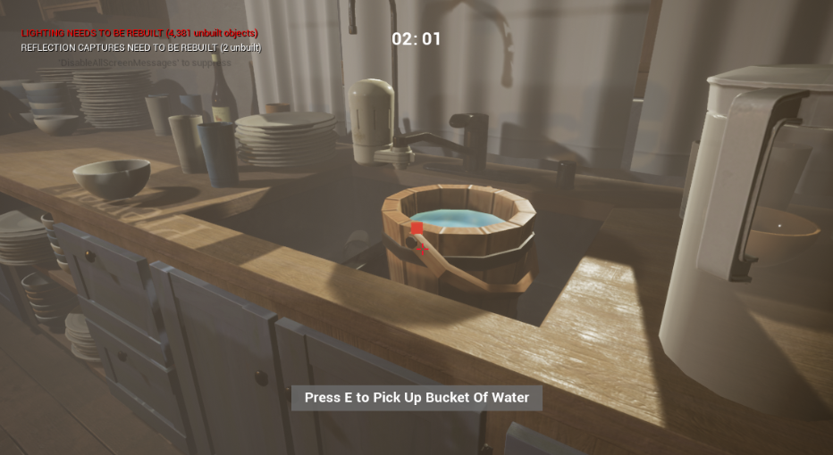
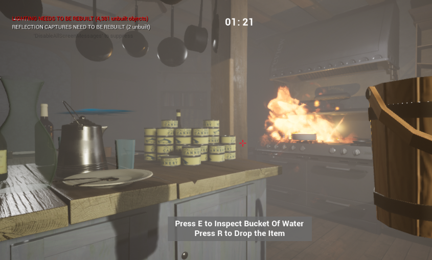
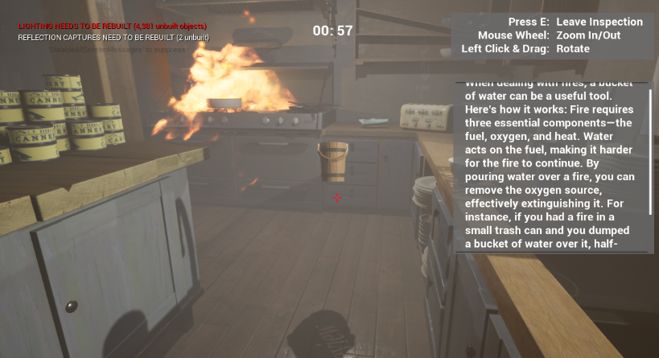
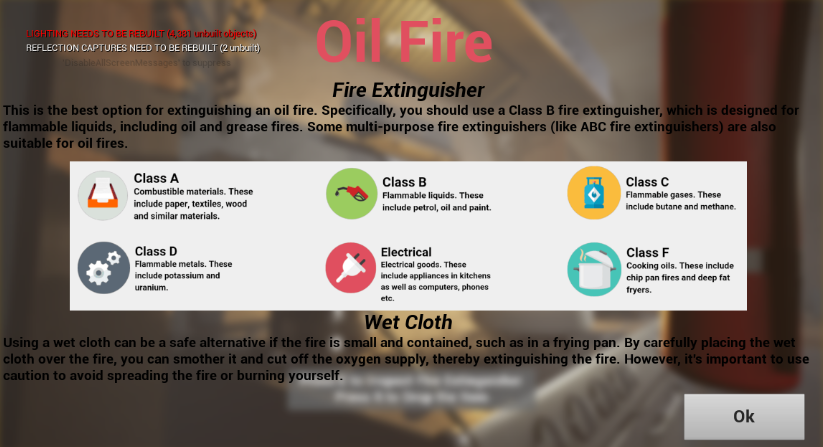
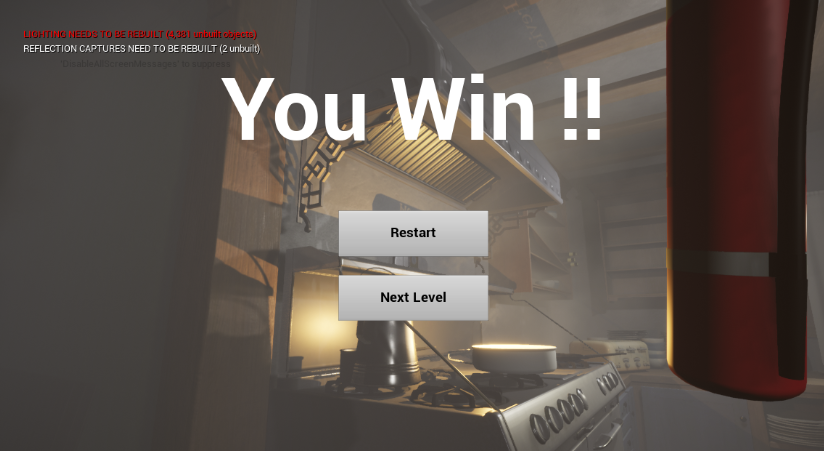
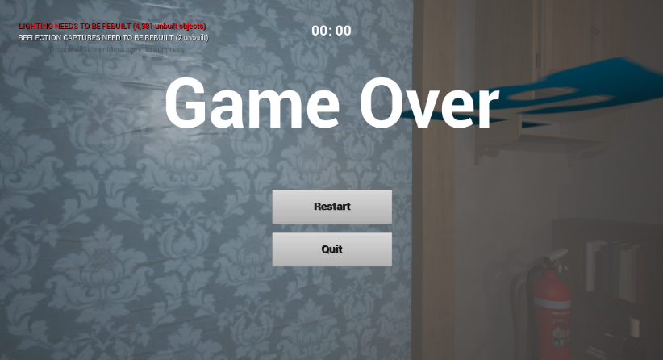

# CGD6334 Game Physics: What Can You Do?

## Report

### Section: TC1L / TT1L

**Student Names and IDs:**
- Ong Shi Yi: 1201101485
- Tan Wui Hong: 1191103366

---

## Table of Contents

1. [Introduction](#introduction)  
2. [Game Details](#game-details)  
    2.1 [Game Type](#game-type)  
    2.2 [Game Features](#game-features)  
        2.2.1 [Player Movement and Controls](#player-movement-and-controls)  
        2.2.2 [Environmental Interaction](#environmental-interaction)  
        2.2.3 [Feedback and Immersion](#feedback-and-immersion)  
        2.2.4 [Camera](#camera)  
        2.2.5 [Particle Effects](#particle-effects)  
        2.2.6 [Sound Effects](#sound-effects)  
        2.2.7 [Countdown Timer](#countdown-timer)  
        2.2.8 [Game End Condition](#game-end-condition)  
    2.3 [Task Distribution](#task-distribution)  
3. [User Manual](#user-manual)  
    3.1 [Game Installation](#game-installation)  
    3.2 [Gameplay](#gameplay)  
        3.2.1 [Game Flow](#game-flow)  
        3.2.2 [How to Play the Game](#how-to-play-the-game)  
    3.3 [Special Game Features](#special-game-features)  
4. [Screenshots of Gameplay](#screenshots-of-gameplay)  
    4.1 [Menu Page](#menu-page)  
    4.2 [Options Page](#options-page)  
    4.3 [Game Screen](#game-screen)  
    4.4 [Look at the Interactable Object](#look-at-the-interactable-object)  
    4.5 [Actions That Can Be Performed After Picking Up Items](#actions-that-can-be-performed-after-picking-up-items)  
    4.6 [Inspection View](#inspection-view)  
    4.7 [Summary of Game Knowledge](#summary-of-game-knowledge)  
    4.8 [Game Win Scene](#game-win-scene)  
    4.9 [Game Over Scene](#game-over-scene)  
5. [Link to Video Demo](#link-to-video-demo)  
6. [Acknowledgement](#acknowledgement)  
7. [References](#references)  

---

## 1.0 Introduction

This game is an educational 3D first-person perspective game that lets players experience and mimic real-life situations requiring critical problem-solving skills. Players need to apply their general life knowledge to navigate dangerous situations within time limits. There are multiple decisions for the player to choose from to solve the difficulties they encounter. This game provides a fun and engaging way to learn critical life-saving techniques in a safe, virtual environment. If the player uses the wrong methods to solve situations, time will be deducted. If the player can't find the correct way within the time limit, they lose; otherwise, they win that level.

---

## 2.0 Game Details

**Title:** What Can You Do?  
**Platform:** PC  
**Game Mode:** Single Player  
**Target Audience:** Age Group 10+, individuals interested in enhancing their practical knowledge and preparedness for real-life situations

### 2.1 Game Type

- **Simulation:** The game mimics real-world activities or systems.
- **Adventure:** The game emphasizes puzzle-solving.
- The game will simulate real-life events that might cause fire hazards. For example:
  - Cooking (oil fire)
  - Electrical fire

### 2.2 Game Features

#### 2.2.1 Player Movement and Controls
Implement movement controls for the player character using the keyboard (WASD). This includes walking, jumping, and interacting with objects. Use Unreal Engine's default first-person character for physics-based movement. Players can take items inside the environment by looking at them. Collectable items will show the text "Press 'E' to pick up [item's name]". Players can also press 'R' to drop the item they are holding. Additionally, they can inspect the item by pressing 'E' while holding it. To use the item to solve a situation, players can click the left mouse button on it.

#### 2.2.2 Environmental Interaction
Enable players to interact with objects in the environment, such as picking up items. Implement collision detection and response for objects in the game world.

#### 2.2.3 Feedback and Immersion
Provide visual and audio feedback to enhance immersion. This includes animations and sound effects to make the game world feel realistic and engaging. Different items used will have different screen prompts to tell the player what they are taking.

#### 2.2.4 Camera
Use Unreal Engine's default first-person character, which includes a default first-person perspective camera.

#### 2.2.5 Particle Effects
Include particle effects that start small and grow larger over time.

#### 2.2.6 Sound Effects
Add sound effects for buttons, burning, and using items to solve the situations.

#### 2.2.7 Countdown Timer
Implement a countdown timer to immerse the player in emergency situations, mimicking real-life scenarios where they must find the best solution quickly.

#### 2.2.8 Game End Condition
The game will end if the player can’t solve the situation within the time limit.

### 2.3 Task Distribution

| Task | By |
|------|----|
| Menu - Main Menu, options (music on/off, volume), pause, and end menu. | Ong Shi Yi |
| Countdown timer | Ong Shi Yi |
| Player interaction to take items from the scene | Ong Shi Yi |
| Sound effects | Ong Shi Yi |
| Game scene design | Ong Shi Yi |
| Particle effects for burning | Tan Wui Hong |
| Player interaction to use items to solve situations | Tan Wui Hong |

---

## 3.0 User Manual

### 3.1 Game Installation

- For those who have already installed Unreal Engine, you can skip this step and proceed to the next steps. Otherwise, you can download it from [Unreal Engine](https://www.unrealengine.com/en-US/download). The instructions are included on the website.

- Download the zip folder from the link [here](https://drive.google.com/file/d/1pz5znQ_JgfaUpsTZk9x-7w4vAMhJewjZ/view?usp=sharing) and extract it.

- Click on Unreal Engine from the left navigation bar of your Epic Games Launcher.

- Choose the Library from the top navigation bar of the Epic Games Launcher.

- If you have version 4.27.2, you can click on the “Launch” button. Otherwise, you need to download that version by clicking the add button beside the ENGINE VERSIONS label. After downloading, proceed to “Launch.”

- After you click on “Launch,” it may take some time to load the project. You will see two sections: Recent Projects and New Project Categories. At the bottom right corner of the Recent Projects section, click on the "More" button.

- Click on the "Browse" button at the bottom right, then choose the folder that you unzipped.

- Click on the file with the .uproject extension, which is the Unreal Engine Project File, and open it.

- After clicking on it, the project file will open. Then, you can click on the "Run" button to start playing the game. It will begin from the title scene.

### 3.2 Gameplay

#### 3.2.1 Game Flow

#### 3.2.2 How to Play the Game

**Movement Controls:**  
Use the 'W', 'A', 'S', 'D' keys to move the character forward, left, backward, and right, respectively. Use the mouse to look around and interact with objects.

**Interacting with Objects:**  
Look directly at the object you want to interact with. Follow the on-screen prompts for available actions (e.g., picking up, inspecting, or using items). Players can take items inside the environment by looking at them.  
- Press 'E' to take the collectable items.  
- Press 'R' to drop the item they are holding.  
- Press 'E' to inspect the item while holding it.  
- Use the left mouse button to solve the situation.  
- Press ‘P’ or ‘Escape’ key to pause the game.

**Game Objectives:**  
Solve the challenges presented in each level using the items and knowledge available. Try to avoid incorrect solutions to save your time.

**Winning and Losing Conditions:**  
- **Win** by finding the correct solutions for the situations within the time limit.  
- **Lose** if the time runs out.

### 3.3 Special Game Features
When players drop an item and then pick it up again, the item will become smaller and smaller. This is a unique game feature that others might think is a bug, but it is actually intentional.

---

## 4.0 Screenshots of Gameplay

### 4.1 Menu Page

### 4.2 Options Page

### 4.3 Game Screen

### 4.4 Look at the Interactable Object

### 4.5 Actions That Can Be Performed After Picking Up Items

### 4.6 Inspection View

### 4.7 Summary of Game Knowledge

### 4.8 Game Win Scene

### 4.9 Game Over Scene

---

## 5.0 Link to Video Demo

[Video Demo Link](https://youtu.be/JNngsGe96YY)

[Report Link](https://drive.google.com/file/d/1foKO-qH1WRRwElguv2gAS4TOBfWQK4zn/view?usp=sharing)

[Project Link](https://drive.google.com/file/d/1pz5znQ_JgfaUpsTZk9x-7w4vAMhJewjZ/view?usp=sharing)

---

## 6.0 Acknowledgement

We would like to thank Dr. Mustakimur Rhaman for his guidance and support throughout the development of this project. His insights and feedback were invaluable in shaping the final product.

---

## 7.0 References

- Unreal Engine Documentation: [Unreal Engine](https://docs.unrealengine.com/en-US/index.html)
- Stack Overflow: For troubleshooting and community support
- YouTube Tutorials: For practical demonstrations and additional learning

---
